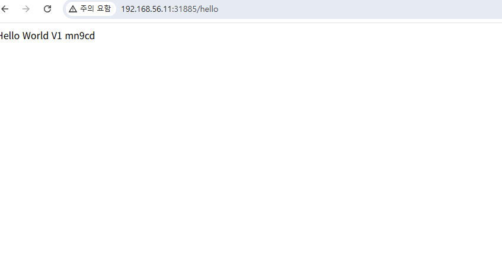

# Kubernetes - ReplicaSet 다루기

## Step-01: ReplicaSet 소개
- **ReplicaSet이란?**
  - 지정된 수의 Pod 복제본을 항상 유지하도록 보장하는 리소스입니다.
  - Pod가 삭제되거나 장애가 발생하면 자동으로 새 Pod를 생성합니다.
- **ReplicaSet 사용의 장점**
  - 고가용성(High Availability) 확보
  - 확장성(Scale-out) 자동화
  - 선언형으로 원하는 복제 수를 유지
---
### HA
고가용성(High Availability, HA)은 한마디로 **“장애가 나도 서비스가 계속 살아있게(또는 아주 짧은 중단만으로) 만드는 설계/운영 목표”**입니다. 단순히 “서버를 2대”가 아니라, 단일 장애 지점(SPOF)을 없애고 자동 복구/자동 전환이 되게 만드는 걸 뜻해요.

1) HA가 보장하려는 것

가용성(Availability): 사용자가 서비스를 “쓸 수 있는 시간의 비율”

99.9% = 월 약 43분 다운타임

99.99% = 월 약 4.3분

99.999% = 월 약 26초

**장애 허용(Fault Tolerance)**에 가깝게 설계하되, 현실적 비용/복잡도와 타협해 “목표 가용성”을 맞춥니다.

2) HA에서 자주 쓰는 핵심 용어

SPOF (Single Point of Failure): 하나만 죽어도 전체가 죽는 지점(단일 DB, 단일 LB, 단일 전원, 단일 네트워크 등)

Failover(장애 조치/전환): 주 인스턴스가 죽으면 대기(Standby)로 자동 전환

Redundancy(중복): 같은 역할을 하는 구성요소를 여러 개 둠 (N+1 같은 표현)

RTO(Recovery Time Objective): “장애 후 복구까지 허용 시간” (예: 1분 이내)

RPO(Recovery Point Objective): “데이터 유실 허용 범위” (예: 0초/5분)

HA는 주로 RTO를 줄이는 것에 초점이 있고, DR(재해복구)은 리전 단위/대규모 사고까지 포함해 RPO/RTO를 더 크게 다룹니다.

3) HA가 필요한 “층(layer)”별 의미
(1) 인프라/서버 레벨

서버 1대 죽어도 다른 서버가 대신 처리

방법: 다중 서버, 다중 AZ(가용영역), 로드밸런서, 오토힐링(자동 재시작/교체)

(2) 애플리케이션 레벨

인스턴스를 여러 개 띄우고 트래픽을 분산

상태를 서버에 두지 않도록(무상태, stateless) 설계하면 HA가 쉬워짐

세션/캐시는 Redis 같은 외부 저장소로

(3) 데이터베이스/스토리지 레벨 (가장 어려움)

복제(Replication): Primary-Replica

자동 장애 조치: Primary 죽으면 Replica 승격

일관성/유실(RPO) 트레이드오프: 동기 vs 비동기 복제

스토리지도 단일 디스크/단일 노드면 SPOF

(4) 네트워크/접속 경로 레벨

LB 이중화, DNS 다중화, 라우팅 우회

인증서/도메인/외부 API 의존성도 장애 원인이 될 수 있음

4) Kubernetes에서 “HA 확보”가 의미하는 것(실무 관점)

K8s에서 HA는 보통 아래를 같이 말합니다.

워크로드(서비스) HA

Deployment replicas >= 2

서로 다른 노드에 분산 배치 (anti-affinity)

Pod 장애 시 자동 재시작, 노드 장애 시 다른 노드로 재배치

HPA로 부하 증가 시 자동 확장

Ingress/Service로 트래픽 분산

클러스터(Control Plane) HA

API Server / etcd / Controller / Scheduler가 단일 노드에만 있으면 그 노드가 죽을 때 클러스터 운영이 마비

HA control plane은 보통:

control-plane 노드 3대(홀수 권장) + etcd quorum

LB를 통해 API Server 엔드포인트 제공

참고: 워크로드는 계속 돌 수 있어도(Control plane 다운이어도 기존 Pod는 잠깐 유지될 수 있음), 스케일/재스케줄/새 배포/복구 같은 “제어”가 안 됩니다. 그래서 control plane HA가 중요합니다.

5) “HA를 했다”를 판단하는 체크리스트

✅ 서버/노드 하나 꺼도 서비스가 계속 응답하는가?

✅ 자동으로 다른 인스턴스로 전환되는가? (수동이면 가용성 떨어짐)

✅ 데이터 유실 허용(RPO)을 만족하는가?

✅ 복구 목표 시간(RTO)을 만족하는가?

✅ LB, DB, 스토리지, 네트워크 등 모든 계층에서 SPOF가 제거됐는가?

✅ 장애 테스트(카오스 테스트/DR 드릴)를 실제로 해봤는가?
---

## 추가 설명
- ReplicaSet은 Pod 수를 유지하는 데 집중하며, 배포 전략(롤링 업데이트/롤백)은 Deployment가 담당합니다.
- 운영 환경에서는 직접 ReplicaSet을 만들기보다 Deployment로 생성하는 패턴이 일반적입니다.

## Step-02: ReplicaSet 생성

### ReplicaSet 생성
- ReplicaSet 매니페스트를 적용합니다.
```
kubectl create -f replicaset-demo.yml
```
---
### 실행경로 확인
```
ubuntu@cp1:~/kubernetes-fundamentals-edumgt$ cd 03*
ubuntu@cp1:~/kubernetes-fundamentals-edumgt/03-ReplicaSets-with-kubectl$ ls -al
total 20
drwxrwxr-x  2 ubuntu ubuntu 4096 Jan 24 07:26 .
drwxrwxr-x 15 ubuntu ubuntu 4096 Jan 24 07:26 ..
-rw-rw-r--  1 ubuntu ubuntu 7526 Jan 24 07:26 README.md
-rw-rw-r--  1 ubuntu ubuntu  357 Jan 24 07:26 replicaset-demo.yml
ubuntu@cp1:~/kubernetes-fundamentals-edumgt/03-ReplicaSets-with-kubectl$
```
---

- **replicaset-demo.yml** 예시
```yml
apiVersion: apps/v1
kind: ReplicaSet
metadata:
  name: my-helloworld-rs
  labels:
    app: my-helloworld
spec:
  replicas: 3
  selector:
    matchLabels:
      app: my-helloworld
  template:
    metadata:
      labels:
        app: my-helloworld
    spec:
      containers:
      - name: my-helloworld-app
        image: stacksimplify/kube-helloworld:1.0.0
```

### ReplicaSet 목록 확인
```
kubectl get replicaset
kubectl get rs
```
---
```
ubuntu@cp1:~/kubernetes-fundamentals-edumgt/03-ReplicaSets-with-kubectl$ kubectl create -f replicaset-demo.yml
replicaset.apps/my-helloworld-rs created
ubuntu@cp1:~/kubernetes-fundamentals-edumgt/03-ReplicaSets-with-kubectl$ kubectl get replicaset
NAME               DESIRED   CURRENT   READY   AGE
my-helloworld-rs   6         6         4       3h18m
nginx-66686b6766   3         3         3       21d
whoami-b85fc56b4   1         1         1       21d
```

### ReplicaSet 상세 확인
```
kubectl describe rs/<replicaset-name>
```
---
```
ubuntu@cp1:~$ kubectl get replicaset
NAME               DESIRED   CURRENT   READY   AGE
nginx-66686b6766   3         3         3       21d
whoami-b85fc56b4   1         1         1       21d
ubuntu@cp1:~$ kubectl describe rs/nginx-66686b6766
Name:           nginx-66686b6766
Namespace:      default
Selector:       app=nginx,pod-template-hash=66686b6766
Labels:         app=nginx
                pod-template-hash=66686b6766
Annotations:    deployment.kubernetes.io/desired-replicas: 3
                deployment.kubernetes.io/max-replicas: 4
                deployment.kubernetes.io/revision: 1
Controlled By:  Deployment/nginx
Replicas:       3 current / 3 desired
Pods Status:    3 Running / 0 Waiting / 0 Succeeded / 0 Failed
Pod Template:
  Labels:  app=nginx
           pod-template-hash=66686b6766
  Containers:
   nginx:
    Image:         nginx
    Port:          <none>
    Host Port:     <none>
    Environment:   <none>
    Mounts:        <none>
  Volumes:         <none>
  Node-Selectors:  <none>
  Tolerations:     <none>
Events:            <none>
```
---
```
kubectl describe rs/my-helloworld-rs
[or]
kubectl describe rs my-helloworld-rs
```

### Pod 목록 확인
```
# Pod 목록
kubectl get pods
kubectl describe pod <pod-name>

# Pod IP 및 노드 정보 포함
kubectl get pods -o wide
```

### Pod의 소유자(Owner) 확인
- Pod YAML의 **ownerReferences.name**에서 소속 ReplicaSet을 확인합니다. 아래의 예시에서
```
  ownerReferences:
  - apiVersion: apps/v1
    blockOwnerDeletion: true
    controller: true
    kind: ReplicaSet
    name: my-helloworld-rs
    uid: 10bcb35a-8835-46a8-b221-14e5b5a054d5
```

```
kubectl get pods <pod-name> -o yaml

kubectl get pods my-helloworld-rs-XXXXX -o yaml
```
---
```
ubuntu@cp1:~/kubernetes-fundamentals-edumgt/03-ReplicaSets-with-kubectl$ kubectl get pods -o wide
NAME                     READY   STATUS    RESTARTS   AGE     IP           NODE   NOMINATED NODE   READINESS GATES
my-first-pod             1/1     Running   0          9h      10.42.2.9    w2     <none>           <none>
my-helloworld-rs-hdqsn   1/1     Running   0          3h23m   10.42.2.12   w2     <none>           <none>
my-helloworld-rs-jq8v2   1/1     Running   0          3h23m   10.42.2.11   w2     <none>           <none>
my-helloworld-rs-mn9cd   1/1     Running   0          3h23m   10.42.1.10   w1     <none>           <none>
my-helloworld-rs-qhbv4   1/1     Running   0          3h23m   10.42.0.23   cp1    <none>           <none>
my-helloworld-rs-shhpc   1/1     Running   0          3h23m   10.42.0.24   cp1    <none>           <none>
my-helloworld-rs-vswg5   1/1     Running   0          3h23m   10.42.1.9    w1     <none>           <none>
nginx-66686b6766-7x2d9   1/1     Running   0          21d     10.42.0.9    cp1    <none>           <none>
nginx-66686b6766-d4xtt   1/1     Running   0          14d     10.42.0.15   cp1    <none>           <none>
nginx-66686b6766-frj65   1/1     Running   0          14d     10.42.0.19   cp1    <none>           <none>
whoami-b85fc56b4-fk6p4   1/1     Running   0          14d     10.42.0.18   cp1    <none>           <none>
```
---
```
kubectl get pods my-helloworld-rs-qhbv4 -o yaml
```
---
```
ubuntu@cp1:~/kubernetes-fundamentals-edumgt/03-ReplicaSets-with-kubectl$ kubectl get pods my-helloworld-rs-qhbv4 -o yaml
apiVersion: v1
kind: Pod
metadata:
  creationTimestamp: "2026-01-24T07:29:56Z"
  generateName: my-helloworld-rs-
  generation: 1
  labels:
    app: my-helloworld
  name: my-helloworld-rs-qhbv4
  namespace: default
  ownerReferences:
  - apiVersion: apps/v1
    blockOwnerDeletion: true
    controller: true
    kind: ReplicaSet
    name: my-helloworld-rs
    uid: 10bcb35a-8835-46a8-b221-14e5b5a054d5
  resourceVersion: "16622"
  uid: e8bf4f9d-ab01-4294-8537-79d08413500a
spec:
  containers:
  - image: stacksimplify/kube-helloworld:1.0.0
    imagePullPolicy: IfNotPresent
    name: my-helloworld-app
    resources: {}
    terminationMessagePath: /dev/termination-log
    terminationMessagePolicy: File
    volumeMounts:
    - mountPath: /var/run/secrets/kubernetes.io/serviceaccount
      name: kube-api-access-bbt69
      readOnly: true
  dnsPolicy: ClusterFirst
  enableServiceLinks: true
  nodeName: cp1
  preemptionPolicy: PreemptLowerPriority
  priority: 0
  restartPolicy: Always
  schedulerName: default-scheduler
  securityContext: {}
  serviceAccount: default
  serviceAccountName: default
  terminationGracePeriodSeconds: 30
  tolerations:
  - effect: NoExecute
    key: node.kubernetes.io/not-ready
    operator: Exists
    tolerationSeconds: 300
  - effect: NoExecute
    key: node.kubernetes.io/unreachable
    operator: Exists
    tolerationSeconds: 300
  volumes:
  - name: kube-api-access-bbt69
    projected:
      defaultMode: 420
      sources:
      - serviceAccountToken:
          expirationSeconds: 3607
          path: token
      - configMap:
          items:
          - key: ca.crt
            path: ca.crt
          name: kube-root-ca.crt
      - downwardAPI:
          items:
          - fieldRef:
              apiVersion: v1
              fieldPath: metadata.namespace
            path: namespace
status:
  conditions:
  - lastProbeTime: null
    lastTransitionTime: "2026-01-24T10:48:05Z"
    observedGeneration: 1
    status: "True"
    type: PodReadyToStartContainers
  - lastProbeTime: null
    lastTransitionTime: "2026-01-24T07:29:56Z"
    observedGeneration: 1
    status: "True"
    type: Initialized
  - lastProbeTime: null
    lastTransitionTime: "2026-01-24T10:48:05Z"
    observedGeneration: 1
    status: "True"
    type: Ready
  - lastProbeTime: null
    lastTransitionTime: "2026-01-24T10:48:05Z"
    observedGeneration: 1
    status: "True"
    type: ContainersReady
  - lastProbeTime: null
    lastTransitionTime: "2026-01-24T07:29:56Z"
    observedGeneration: 1
    status: "True"
    type: PodScheduled
  containerStatuses:
  - containerID: containerd://d9cefe2e6e4b9caf576981eb00066af5fef26f11b16085d682b64ee8668e49d8
    image: docker.io/stacksimplify/kube-helloworld:1.0.0
    imageID: docker.io/stacksimplify/kube-helloworld@sha256:eae077a33d55d74407e399fd6e3bfb12cfe98dd1be29173861579584cb175ed8
    lastState: {}
    name: my-helloworld-app
    ready: true
    resources: {}
    restartCount: 0
    started: true
    state:
      running:
        startedAt: "2026-01-24T10:48:03Z"
    user:
      linux:
        gid: 0
        supplementalGroups:
        - 0
        - 1
        - 2
        - 3
        - 4
        - 6
        - 10
        - 11
        - 20
        - 26
        - 27
        uid: 0
    volumeMounts:
    - mountPath: /var/run/secrets/kubernetes.io/serviceaccount
      name: kube-api-access-bbt69
      readOnly: true
      recursiveReadOnly: Disabled
  hostIP: 192.168.56.10
  hostIPs:
  - ip: 192.168.56.10
  observedGeneration: 1
  phase: Running
  podIP: 10.42.0.23
  podIPs:
  - ip: 10.42.0.23
  qosClass: BestEffort
  startTime: "2026-01-24T07:29:56Z"
```
---
## Step-03: ReplicaSet을 Service로 노출
- NodePort Service를 통해 외부에서 접근할 수 있도록 구성합니다.

### NodePort Service 설명 (핵심 개념)
클러스터의 모든 Node(워커/컨트롤플레인 포함 가능)의 특정 포트(노드 포트)를 열어서, 그 포트로 들어오는 트래픽을 Service → Pod로 전달해주는 방식입니다.

```
Service 타입: NodePort

노드에서 열리는 포트 범위(일반적으로): 30000–32767

외부 접근 형태:

http://<노드IP>:<NodePort> 로 접속
```
---

NodePort에서 자주 나오는 포트 3종류

Service YAML에서 보통 이렇게 보입니다.

port: Service가 클러스터 내부에서 제공하는 포트 (가상 포트)

targetPort: 실제 Pod 컨테이너가 리스닝하는 포트

nodePort: 노드에 실제로 열리는 외부 접근 포트

예:

nodePort: 30080 → 외부는 노드IP:30080

port: 80 → 클러스터 내부에서 서비스는 80으로 보임

targetPort: 8080 → Pod 컨테이너는 8080으로 받음

NodePort의 트래픽 흐름

### 외부 사용자
→ NodeIP:NodePort
→ (kube-proxy / iptables/IPVS 규칙)
→ Service(ClusterIP)
→ Pod IP:targetPort

NodePort 장단점

### 장점

실습/온프레미스에서 간단히 외부 노출 가능

로드밸런서(LB) 없이도 테스트 가능

### 단점

“서비스당 포트”를 하나씩 소비 (포트 관리 번거로움)

보안/운영 관점에서 직접 노드 포트를 열어두는 방식은 제한적일 수 있음

보통 운영에서는 Ingress + LoadBalancer(또는 MetalLB) 같은 구성이 더 일반적

---

```
# ReplicaSet을 Service로 노출
kubectl expose rs <ReplicaSet-Name> --type=NodePort --port=80 --target-port=8080 --name=<Service-Name-To-Be-Created>
kubectl expose rs my-helloworld-rs --type=NodePort --port=80 --target-port=8080 --name=my-helloworld-rs-service
```
---
```
ubuntu@cp1:~/kubernetes-fundamentals-edumgt/03-ReplicaSets-with-kubectl$ kubectl expose rs my-helloworld-rs --type=NodePort --port=80 --target-port=8080 --name=my-helloworld-rs-service
service/my-helloworld-rs-service exposed
```
# Service 정보 확인
kubectl get service
kubectl get svc

```
ubuntu@cp1:~/kubernetes-fundamentals-edumgt/03-ReplicaSets-with-kubectl$ kubectl get service
NAME                       TYPE        CLUSTER-IP     EXTERNAL-IP   PORT(S)        AGE
kubernetes                 ClusterIP   10.43.0.1      <none>        443/TCP        21d
my-helloworld-rs-service   NodePort    10.43.45.254   <none>        80:31885/TCP   29s
whoami                     ClusterIP   10.43.69.242   <none>        80/TCP         21d
```

# 워커 노드 Public IP 확인
kubectl get nodes -o wide
```
ubuntu@cp1:~/kubernetes-fundamentals-edumgt/03-ReplicaSets-with-kubectl$ kubectl get nodes -o wide
NAME   STATUS   ROLES           AGE   VERSION        INTERNAL-IP     EXTERNAL-IP   OS-IMAGE             KERNEL-VERSION       CONTAINER-RUNTIME
cp1    Ready    control-plane   21d   v1.34.3+k3s1   192.168.56.10   <none>        Ubuntu 22.04.5 LTS   5.15.0-164-generic   containerd://2.1.5-k3s1
w1     Ready    <none>          21d   v1.34.3+k3s1   192.168.56.11   <none>        Ubuntu 22.04.5 LTS   5.15.0-164-generic   containerd://2.1.5-k3s1
w2     Ready    <none>          21d   v1.34.3+k3s1   192.168.56.12   <none>        Ubuntu 22.04.5 LTS   5.15.0-164-generic   containerd://2.1.5-k3s1
```
---
```
- **접근 예시**
```
http://<node1-public-ip>:<Node-Port>/hello
http://192.168.56.11:31885/hello
```


```
---


## Step-04: ReplicaSet의 고가용성 테스트
- Pod를 강제로 삭제해도 ReplicaSet이 자동 복구하는지 확인합니다.
```
# Pod 목록 확인
kubectl get pods

# Pod 삭제
kubectl delete pod <Pod-Name>

# 자동 복구 확인 (새 Pod 이름/시간 확인)
kubectl get pods
```

## Step-05: ReplicaSet 스케일링 테스트
- `replicaset-demo.yml`의 **replicas** 값을 3에서 6으로 변경합니다.
```
# 변경 전
spec:
  replicas: 3

# 변경 후
spec:
  replicas: 6
```
- ReplicaSet 업데이트
```
# 변경사항 적용
kubectl replace -f replicaset-demo.yml

# 새 Pod 생성 확인
kubectl get pods -o wide
```

## Step-06: ReplicaSet 및 Service 삭제

### ReplicaSet 삭제
```
# ReplicaSet 삭제
kubectl delete rs <ReplicaSet-Name>

# 예시
kubectl delete rs/my-helloworld-rs
[or]
kubectl delete rs my-helloworld-rs

# 삭제 확인
kubectl get rs
```

### Service 삭제
```
# Service 삭제
kubectl delete svc <service-name>

# 예시
kubectl delete svc my-helloworld-rs-service
[or]
kubectl delete svc/my-helloworld-rs-service

# 삭제 확인
kubectl get svc
```

